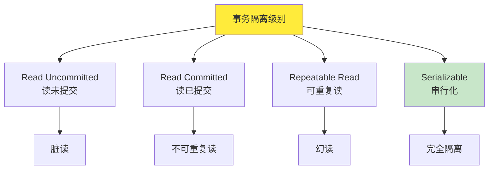
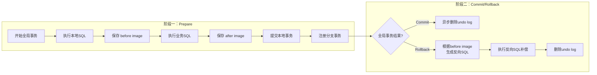
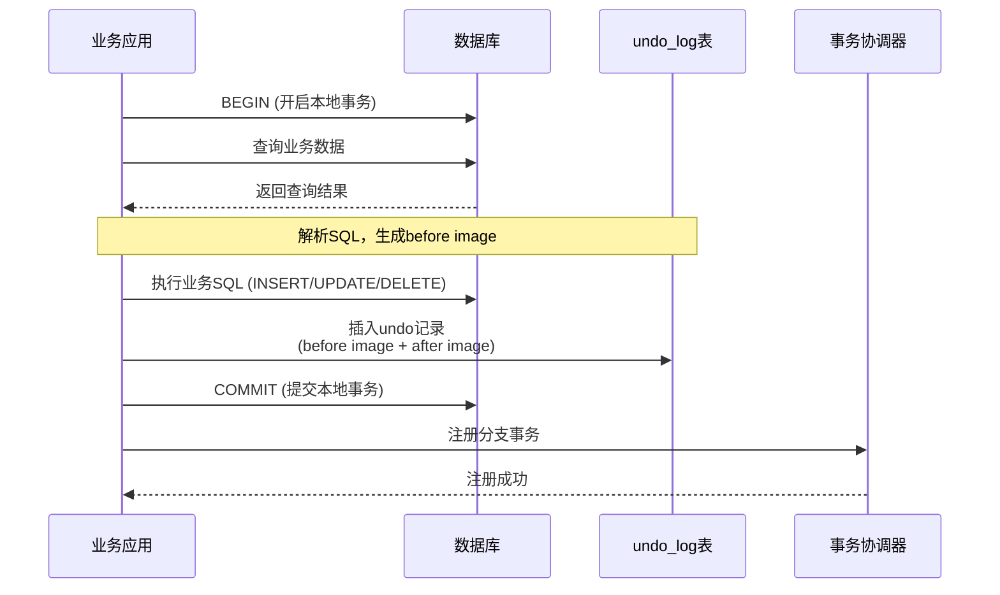
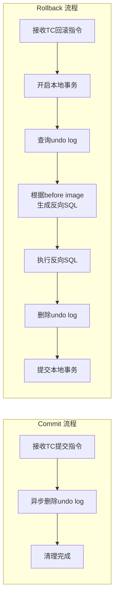
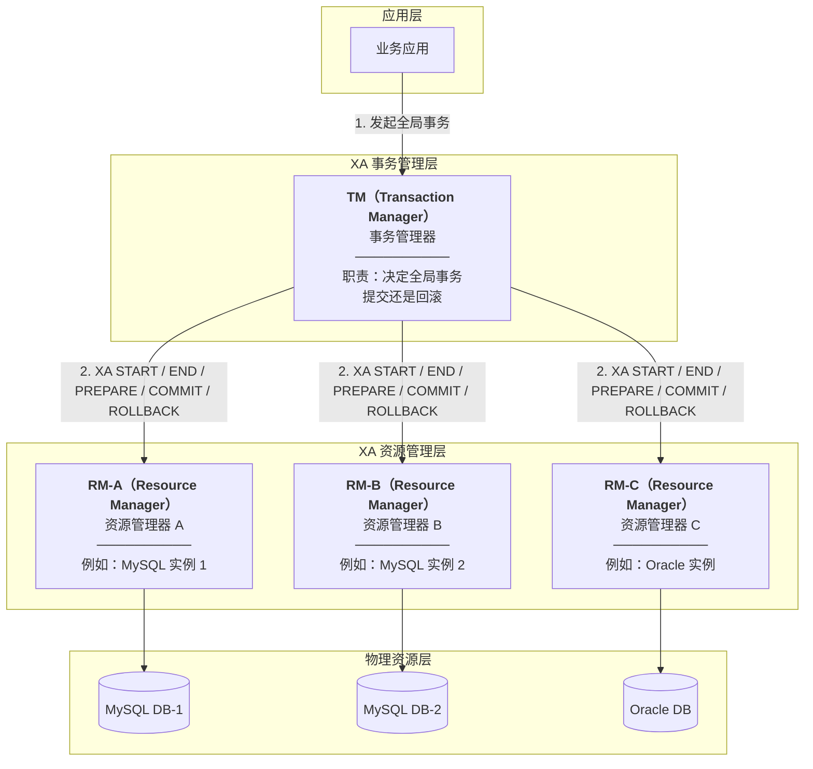
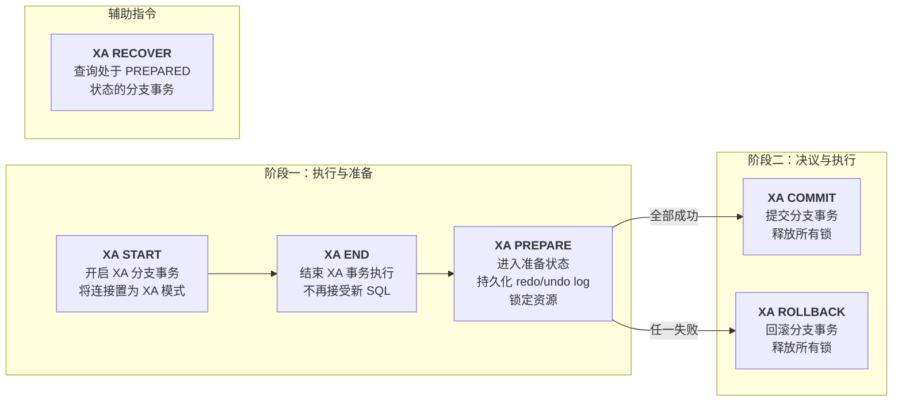
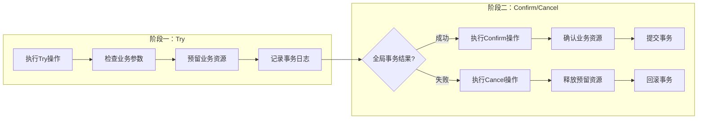
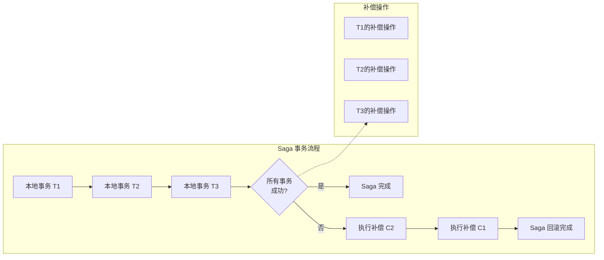

# seata学习之旅

# 1.seata的简介

Seata 是一款开源的分布式事务解决方案，致力于提供高性能和简单易用的分布式事务服务。Seata 将为用户提供了 **AT**、**TCC**、**SAGA** 和 **XA** 事务模式，为用户打造一站式的分布式解决方案。

## 1.1.项目历史

1. 早在 2007 年，阿里巴巴和蚂蚁集团内部开发了分布式事务中间件，用于解决电商、支付、物流等业务场景中应用数据的一致性问题。内部项目分别被称为 TXC (Taobao Transaction Constructor)/XTS(eXtended Transaction Service)，该项目几乎在每笔订单的交易支付链路几乎都有使用。
2. 自 2013 年以来，阿里巴巴和蚂蚁集团已在阿里云和金融云上向企业客户分别发布了分布式事务云服务产品 GTS(global transaction service)/DTX(Distributed Transaction-eXtended)，在各个行业领域积累了大量用户。
3. 2019 年 1 月，阿里巴巴集团正式开源了该项目，项目命名为 Fescar (Fast & Easy Commit and Rollback)）。项目开源以来，它受到了众多开发人员的热烈欢迎和赞扬，开源一周收获了超 3k star，曾一度蝉联 GitHub Trending 排行榜第一。
4. 2019 年 4 月，蚂蚁集团数据中间件团队加入了 Fescar 社区。为了创建一个更加开放和中立的社区，Fescar 改名为 Seata（Simple Extensible Autonomous Transaction Architecture），代码仓库从 Alibaba organization 迁移到其独立的 Seata organization。
5. 2019 年 12 月，Seata 开源项目正式发布 1.0.0 GA 版本，标志着项目已基本可生产使用。
6. 2023 年 10 月，为了更好的通过社区驱动技术的演进，阿里和蚂蚁集团正式将 Seata 捐赠给 Apache 基金会，该提案已通过了 Apache 基金会的投票决议，Seata 正式进入 Apache 孵化器

## 1.2.Seata术语

| 角色                                         | 作用                                                         | 组件                                                         |
| -------------------------------------------- | ------------------------------------------------------------ | ------------------------------------------------------------ |
| TC (Transaction Coordinator) <br/>事务协调者 | 维护全局和分支事务的状态，<br/>驱动全局事务提交或回滚。      | **Seata Server**                                             |
| TM (Transaction Manager) <br/>事务管理器     | 定义全局事务的范围：<br/>开始全局事务、<br/>提交或回滚全局事务。 | 嵌入在业务服务里的"发起人"<br/>通常是**全局事务的发起方**<br/>如:订单服务 |
| RM (Resource Manager) <br/>资源管理器        | 管理分支事务处理的资源，<br/>与TC交谈以注册分支事务和报告分支事务的状态，<br/>并驱动分支事务提交或回滚。 | 微服务，如:订单服务，客户服务                                |

# 1.3.基础知识补充

### 1.3.1.CAP理论

1998年，加州大学的计算机科学家 Eric Brewer 提出，分布式系统有三个指标：

- Consistency（一致性）
- Availability（可用性）
- Partition tolerance （分区容错性）

Eric Brewer 说，分布式系统无法同时满足这三个指标(最多满足两项，其中P是必须的)。这个结论就叫做 CAP 定理。

### 1.3.2.BASE理论

| 原则                                   | 说明                                                         |
| -------------------------------------- | ------------------------------------------------------------ |
| **Basically Available** (基本可用)     | 分布式系统在出现不可预知故障的时候，允许损失部分可用性来满足其他需求 |
| **Soft state** (软状态)                | 允许系统存在中间状态，而该中间状态不会影响系统整体可用性     |
| **Eventually consistent** (最终一致性) | 系统中的所有数据副本经过一段时间的同步后，最终能够达到一个一致的状态 |

### 1.3.3.事务隔离级别



#### 1.3.3.1.并发问题

**脏读（Dirty Read）**

一个事务读到了另一个事务**尚未提交**的数据。如果后者回滚了，前者读到的就是根本不存在的"脏数据"。

> 例：A 把余额从 100 改成 200 但还没提交，B 读到了 200；A 突然回滚成 100，B 拿到的 200 就是脏读。

**不可重复读（Non-Repeatable Read）**

同一个事务内，**两次读取同一行数据，结果不一样**（因为别的事务在这期间提交了 update）。

> 例：事务 A 先后两次读 id=1 的余额，第一次 100，第二次变成 200——被别的事务改并提交过了。

**幻读（Phantom Read）**

同一个事务内，**两次执行同样的查询条件，返回的行数不一样**（因为别的事务插入/删除了符合该条件的行并提交）。

> 例：事务 A 查"分数 > 90 的有多少人"，第一次 5 人，第二次 6 人——别的事务新插入了一条符合条件的记录。

> 💡 不可重复读侧重**已有行的内容被改**，幻读侧重**结果集的行数变了**

#### 1.3.3.2.四级隔离级别对照

| 隔离级别                                       | 脏读            | 不可重复读      | 幻读                                        | 实现思路                                              |
| ---------------------------------------------- | --------------- | --------------- | ------------------------------------------- | ----------------------------------------------------- |
| **Read_Uncommitted<br/>**（读未提交）          | ❌ <br/>可能发生 | ❌ <br/>可能发生 | ❌ <br/>可能发生                             | 啥锁都不加，直接读                                    |
| **Read_Committed**<br/>（读已提交）            | ✅ <br/>防止     | ❌ <br/>可能发生 | ❌ 可能发生                                  | 写加锁，<br/>读不加锁，<br/>只读取已提交版本          |
| **Repeatable_Read**<br/>（可重复读）           | ✅ <br/>防止     | ✅ <br/>防止     | ❌ <br/>可能发生<br/>（MySQL InnoDB 下防止） | 第一次读就给涉及的数据加锁，<br/>保证事务内多次读一致 |
| **Serializable**<br/>（串行化 / **完全隔离**） | ✅ <br/>防止     | ✅ <br/>防止     | ✅ <br/>防止                                 | 事务串行执行，<br/>完全不允许并发                     |

> **Serializable = 完全隔离**：它是隔离级别的最高档，通过让事务**完全串行执行**（或加范围锁/谓词锁），彻底杜绝脏读、不可重复读、幻读三类问题。代价是并发性能最低，吞吐量下降明显。

# 2.seata的TC搭建

编写docker-compose.yaml文件，内容如下：

```yaml
version: '3.8'

services:
  seata-server:
    image: docker.xuanyuan.run/apache/seata-server:2.1.0 # 该镜像没有MySQL驱动
    container_name: seata-server
    restart: always
    ports:
      - "8091:8091"   # 事务 RPC 端口，业务服务连接此端口
      - "7091:7091"   # Web 控制台端口
    environment:
      # 注册中心 - Nacos
      - SEATA_IP=172.31.18.86 # 注册真实IP，否则客户端无法访问docker内部的IP
      - SEATA_REGISTRY_TYPE=nacos
      - SEATA_REGISTRY_NACOS_SERVER_ADDR=nacos:8848
      - SEATA_REGISTRY_NACOS_NAMESPACE=SEATA
      - SEATA_REGISTRY_NACOS_GROUP=DEFAULT_GROUP
      - SEATA_REGISTRY_NACOS_USERNAME=nacos
      - SEATA_REGISTRY_NACOS_PASSWORD=123456
      - SEATA_REGISTRY_NACOS_CLUSTER=default
      # 配置中心 - Nacos
      - SEATA_CONFIG_TYPE=nacos
      - SEATA_CONFIG_NACOS_SERVER_ADDR=nacos:8848
      - SEATA_CONFIG_NACOS_NAMESPACE=SEATA
      - SEATA_CONFIG_NACOS_GROUP=DEFAULT_GROUP
      - SEATA_CONFIG_NACOS_DATA_ID=seataServer.properties
      - SEATA_CONFIG_NACOS_USERNAME=nacos
      - SEATA_CONFIG_NACOS_PASSWORD=123456
      # 可选：多网卡环境下指定对外 IP
      # - SEATA_IP=宿主机IP
    # 挂载
    volumes:
      - ./libs/mysql-connector-j-8.0.33.jar:/seata-server/libs/mysql-connector-j-8.0.33.jar
    networks:
      - app-net
networks:
  app-net:
    external: true
```

下载MySQL驱动

```tree
cmo@matebook:/myapp/docker-seata$ tree
├── docker-compose.yml
└── libs
    ├── mysql-connector-j-8.0.33.jar
```

运行下面的命令即可

```shell
docker compose up -d
```

 # 3.AT模式

AT（Automatic Transaction）模式是 Seata 的默认模式，一种基于支持本地 ACID 事务的关系型数据库的两阶段提交协议的演进模式。

**核心特点：**

- 无侵入性：对业务代码零侵入
- 自动补偿：自动生成反向补偿 SQL
- 基于 undo log：通过 undo log 实现回滚

---

**AT 模式优缺点**

**优点：**

- ✅ 无侵入：对业务代码零侵入
- ✅ 易用：自动处理回滚，无需手动编写补偿逻辑
- ✅ 高效：基于数据库本地事务，性能较好
- ✅ 自动：自动生成反向补偿 SQL

**缺点：**

- ❌ 全局锁：阶段一持有全局锁，并发度受限
- ❌ 隔离性：默认读未提交隔离级别，可能读到未提交数据
- ❌ 数据库限制：仅支持支持本地事务的关系型数据库
- ❌ 长事务：长事务会长时间持有全局锁

---

**工作原理**



## 3.1.两阶段执行流程

### 3.1.1.阶段一（Prepare）



**阶段一详细步骤：**

1. **解析 SQL**：解析业务 SQL，识别操作类型
2. **查询 before image**：查询业务 SQL 执行前的数据快照
3. **执行业务 SQL**：执行实际的数据库操作
4. **查询 after image**：查询业务 SQL 执行后的数据快照
5. **插入 undo log**：将 before image 和 after image 插入 undo_log 表
6. **提交本地事务**：提交本地数据库事务
7. **注册分支事务**：向 TC 注册分支事务

### 3.1.2.阶段二（Commit/Rollback）



## 3.2.Undo Log 表结构

```mysql
CREATE TABLE `undo_log` (
  `id` bigint(20) NOT NULL AUTO_INCREMENT,
  `branch_id` bigint(20) NOT NULL,
  `xid` varchar(100) NOT NULL,
  `context` varchar(128) NOT NULL,
  `rollback_info` longblob NOT NULL,
  `log_status` int(11) NOT NULL,
  `log_created` datetime NOT NULL,
  `log_modified` datetime NOT NULL,
  PRIMARY KEY (`id`),
  UNIQUE KEY `ux_undo_log` (`xid`,`branch_id`)
) ENGINE=InnoDB DEFAULT CHARSET=utf8;
```

**字段说明：**

| 字段名        | 类型     | 说明                             |
| ------------- | -------- | -------------------------------- |
| id            | bigint   | 主键ID                           |
| branch_id     | bigint   | 分支事务ID                       |
| xid           | varchar  | 全局事务ID                       |
| context       | varchar  | 上下文信息（序列化方式等）       |
| rollback_info | longblob | 回滚信息（before/after image）   |
| log_status    | int      | 日志状态（0-正常，1-防御性回滚） |
| log_created   | datetime | 创建时间                         |
| log_modified  | datetime | 修改时间                         |

# 4.XA 模式

XA 模式是一种基于 XA 协议的两阶段提交（2PC）实现，遵循 X/Open XA 规范。XA 模式是真正的两阶段提交协议。

**核心特点：**

- 标准协议：遵循 X/Open XA 国际标准
- 强一致性：提供强一致性保证
- 数据库支持：依赖数据库的 XA 事务支持

---

**XA 模式优缺点**

**优点：**

- ✅ 强一致性：提供强一致性保证
- ✅ 标准协议：遵循 XA 标准，兼容性好
- ✅ 无侵入：对业务代码无侵入
- ✅ 隔离性好：具有完整的隔离性保证

**缺点：**

- ❌ 性能较差：两阶段提交，资源锁定时间长
- ❌ 阻塞问题：Prepare 后资源被阻塞，直到 Commit/Rollback
- ❌ 单点故障：TM 故障可能导致资源长期锁定
- ❌ 数据库要求：需要数据库支持 XA 协议

---

XA 协议由 X/Open 组织定义，其核心思想是将事务的 **决策权** 与 **执行权** 分离。整个架构由三个角色组成：



> **关键理解：** XA 协议的本质是一个 **投票机制**。TM 问每个 RM："你准备好了吗？"，只有所有 RM 都回答"准备好了"（PREPARED），TM 才会下达最终的 Commit 指令；只要有一个 RM 回答"不行"，TM 就会下达 Rollback 指令。


XA 协议定义了一组标准指令，TM 通过这些指令驱动 RM 完成事务的各个阶段：



**阶段一：**

> **① XA START（开启分支）**
>
> TM 为每个参与的数据库分别发送 `XA START` 指令。数据库收到后，会将该连接标记为 XA 事务模式。此后，该连接上执行的所有 SQL 都会被纳入同一个 XA 分支事务中，直到收到 `XA END` 为止。
>
> **② 执行业务 SQL**
>
> 业务应用通过 RM 执行实际的数据库操作（INSERT/UPDATE/DELETE）。此时数据库的行为与普通事务一致：在 Buffer Pool 中修改数据页、对修改的行加排他锁、生成 redo log 和 undo log。**但此时 redo log 还在内存中，尚未刷盘。**
>
> **③ XA END + XA PREPARE（准备提交）**
>
> 这是 XA 协议最关键的一步。`XA END` 告知数据库 SQL 执行完毕，`XA PREPARE` 则要求数据库做出"承诺"：
>
> - 数据库将 redo log 和 undo log **强制刷盘**（fsync），确保即使数据库宕机，修改也不会丢失
> - 数据库将事务状态持久化为 **PREPARED**
> - **行锁和表锁继续保持**，其他事务无法修改这些数据
> - RM 向 TM 返回投票结果（YES 或 NO）
>
> ⚠️ **重要：** 从 `XA PREPARE` 成功到 `XA COMMIT/ROLLBACK` 执行完毕的这段时间内，所有被修改的行都处于 **锁定状态**。这就是 XA 模式性能较差的根本原因。


**阶段二：**

> **决议规则（原子提交协议）：**
>
> XA 协议遵循 **全有或全无** 的原则：
>
> - **全部 YES**：只要所有 RM 都返回 PREPARED，TM 就决定 COMMIT。即使此时 TM 宕机，重启后也能通过 `XA RECOVER` 找到所有 PREPARED 的分支并完成提交。
> - **任一 NO**：只要有一个 RM 返回失败（或超时未响应），TM 就决定 ROLLBACK **所有** 分支，包括那些已经 PREPARE 成功的分支。
>
> **Commit 执行：**
>
> 数据库收到 `XA COMMIT` 后，由于阶段一已经将所有日志刷盘，此时只需将事务状态标记为 COMMITTED 并释放锁即可。这是一个 **轻量操作**，通常很快完成。
>
> **Rollback 执行：**
>
> 数据库收到 `XA ROLLBACK` 后，利用阶段一持久化的 undo log 逆向回滚所有修改，然后释放锁。回滚的耗时取决于修改的数据量。


**XA 模式一句话理解**

> **XA 模式 = "先让所有人把答案写在纸上锁进抽屉（PREPARE），等老师（TC）说'交卷'（COMMIT）或'撕掉'（ROLLBACK），在老师发话之前，谁都不能动抽屉里的东西。"**

# 5.TCC模式

TCC（Try-Confirm-Cancel）模式是一种补偿型的分布式事务解决方案，通过业务层面的两阶段提交来实现分布式事务。

**核心特点：**

- 业务侵入：需要编写 Try、Confirm、Cancel 三个方法
- 高性能：无全局锁，并发度高
- 灵活性：业务可控性强

**TCC的执行流程：**



TCC 模式优缺点

**优点：**

- ✅ 高性能：无全局锁，并发度高
- ✅ 灵活性：业务可控，可自定义资源预留逻辑
- ✅ 隔离性好：Try 阶段预留资源，避免脏读
- ✅ 适用性广：不依赖数据库特性

**缺点：**

- ❌ 业务侵入：需要编写 Try/Confirm/Cancel 三个方法
- ❌ 开发成本：需要处理幂等、空回滚、悬挂等问题
- ❌ 复杂性：业务逻辑复杂，维护成本高
- 资源预留：需要设计资源预留机制

## 5.1.三阶段详解

#### 5.1.1.Try 阶段

**职责：**业务检查（一致性）；资源预留（隔离性）

**要求：**幂等性：允许重复调用；可回滚：必须有对应的 Cancel 操作

#### 5.1.2.Confirm 阶段

**职责：**确认执行；使用 Try 阶段预留的资源

**要求：**幂等性：允许重复调用；允许失败：失败需要重试

#### 5.1.3.Cancel 阶段

**职责：**释放 Try 阶段预留的资源；回滚业务状态

**要求：**幂等性：允许重复调用；允许失败：失败需要重试

## 5.2.示例

分布式转账场景：账户A扣款，账户B加款

```java
// 1. TCC 接口定义
public interface AccountTccService {
    
    @TwoPhaseBusinessAction(name = "accountTccAction", 
                            commitMethod = "confirm", 
                            rollbackMethod = "cancel")
    boolean tryMethod(BusinessActionContext actionContext,
                      @BusinessActionContextParameter(paramName = "accountId") String accountId,
                      @BusinessActionContextParameter(paramName = "amount") BigDecimal amount);
    
    boolean confirm(BusinessActionContext actionContext);
    
    boolean cancel(BusinessActionContext actionContext);
}

// 2. TCC 服务实现
@Service
public class AccountTccServiceImpl implements AccountTccService {
    
    @Autowired
    private AccountMapper accountMapper;
    
    @Override
    public boolean tryMethod(BusinessActionContext actionContext, 
                             String accountId, 
                             BigDecimal amount) {
        // Try阶段：冻结资金
        Account account = accountMapper.selectByAccountId(accountId);
        
        // 业务检查
        if (account.getBalance().compareTo(amount) < 0) {
            throw new BusinessException("余额不足");
        }
        
        // 预留资源（冻结资金）
        accountMapper.freeze(accountId, amount);
        
        // 记录冻结日志
        FrozenLog log = new FrozenLog();
        log.setXid(actionContext.getXid());
        log.setBranchId(String.valueOf(actionContext.getBranchId()));
        log.setAccountId(accountId);
        log.setAmount(amount);
        log.setStatus("FROZEN");
        frozenLogMapper.insert(log);
        
        return true;
    }
    
    @Override
    public boolean confirm(BusinessActionContext actionContext) {
        // Confirm阶段：确认扣款
        String accountId = (String) actionContext.getActionContext("accountId");
        BigDecimal amount = (BigDecimal) actionContext.getActionContext("amount");
        
        // 幂等性检查
        if (isConfirmed(actionContext.getXid(), actionContext.getBranchId())) {
            return true;
        }
        
        // 确认扣款（将冻结资金转为已扣款）
        accountMapper.confirmDeduct(accountId, amount);
        
        // 更新冻结日志状态
        frozenLogMapper.updateStatus(actionContext.getXid(), 
                                     actionContext.getBranchId(), "CONFIRMED");
        
        return true;
    }
    
    @Override
    public boolean cancel(BusinessActionContext actionContext) {
        // Cancel阶段：解冻资金
        String accountId = (String) actionContext.getActionContext("accountId");
        BigDecimal amount = (BigDecimal) actionContext.getActionContext("amount");
        
        // 幂等性检查
        if (isCancelled(actionContext.getXid(), actionContext.getBranchId())) {
            return true;
        }
        
        // 解冻资金（释放冻结）
        accountMapper.cancelFreeze(accountId, amount);
        
        // 更新冻结日志状态
        frozenLogMapper.updateStatus(actionContext.getXid(), 
                                     actionContext.getBranchId(), "CANCELLED");
        
        return true;
    }
    
    private boolean isConfirmed(String xid, Long branchId) {
        // 检查是否已经确认
        FrozenLog log = frozenLogMapper.selectByXidAndBranchId(xid, branchId);
        return log != null && "CONFIRMED".equals(log.getStatus());
    }
    
    private boolean isCancelled(String xid, Long branchId) {
        // 检查是否已经取消
        FrozenLog log = frozenLogMapper.selectByXidAndBranchId(xid, branchId);
        return log != null && "CANCELLED".equals(log.getStatus());
    }
}

// 3. 业务调用方
@Service
public class TransferService {
    
    @Autowired
    private AccountTccService accountTccService;
    
    @GlobalTransactional
    public void transfer(String fromAccount, String toAccount, BigDecimal amount) {
        // 扣款（TCC）
        accountTccService.tryMethod(null, fromAccount, amount);
        
        // 加款（TCC）
        accountTccService.tryMethod(null, toAccount, amount);
        
        // 如果这里抛出异常，所有TCC操作都会执行Cancel
        // throw new RuntimeException("转账失败");
    }
}
```

## 5.3.TCC常见问题

### 5.3.1空回滚

空回滚是指：**在 Try 阶段并没有成功执行（资源没有被预留）的情况下，Cancel 阶段却被触发了。** 如果 Cancel 方法没有做特殊处理，直接去执行“释放预留资源”的逻辑，就会导致业务数据错误（例如：把原本没有冻结的钱给解冻了，导致账户余额凭空增加）。

**产生的原因**

空回滚通常由以下两种网络异常场景引起：

- **场景 A（Try 调用失败）：** 事务协调器（TC）调用分支服务的 Try 方法时，由于网络闪断或分支服务宕机，Try 请求根本没有到达，或者在分支服务内部抛出了异常导致 Try 失败。TC 判定该分支事务失败，于是发起了全局回滚，调用了 Cancel 方法。
- **场景 B（Try 响应超时）：** Try 请求其实到达了分支服务，但在分支服务执行完毕返回结果时，网络延迟导致 TC 等待超时。TC 认为 Try 失败，触发了 Cancel。

**核心矛盾：** TC 认为 Try 失败了所以调用 Cancel，但分支服务实际上并没有完成资源预留。此时 Cancel 如果盲目执行“反向补偿（释放资源）”，就会补偿过头。

**解决方案**

核心思想：在 Cancel 执行前，先确认 Try 是否真的执行过。如果没有执行过，Cancel 就“什么都不做”，直接返回成功。

具体实现步骤：

1. **引入事务控制表：** 在分支服务的本地数据库中创建一张事务控制表（如 `tcc_transaction_control`），包含字段：`xid`（全局事务ID）、`branch_id`（分支事务ID）、`status`（状态）。
2. **Cancel 拦截逻辑：** 当 Cancel 方法被调用时，首先根据 `xid` 和 `branch_id` 去事务控制表中查询记录。
3. 判断与处理：
   - **如果查不到记录：** 说明 Try 阶段确实没有执行成功（或者没有插入记录）。此时，**绝对不能执行释放资源的业务逻辑**。而是直接向控制表中插入一条记录（状态标记为“已空回滚”或“CANCELLED”），然后直接返回 `true`（告诉 TC 回滚成功）。
   - **如果查到了记录（状态为 Try 已执行）：** 说明 Try 确实执行过，资源被预留了。此时正常执行 Cancel 的业务逻辑（释放预留资源），并将控制表状态更新为“CANCELLED”。

### 5.3.2.悬挂问题

指Try 阶段预留的资源，因为全局事务已经回滚，导致这些资源永远无法被 Confirm 或 Cancel 释放，从而永久被“冻结”或“占用”。

**产生的原因**

悬挂问题通常是**空回滚问题的衍生并发症**，由“网络延迟导致的请求乱序”引起：

**发生过程**：

1. TC 调用 Try 方法，由于网络拥堵，请求在网络上“飘”了很久。
2. TC 等待超时，认为 Try 失败，于是触发了 Cancel 方法。
3. Cancel 方法执行时，发现控制表里没有记录（触发了**空回滚**），于是插入了一条“已空回滚”的记录，并返回成功。此时全局事务回滚完毕。
4. **关键时刻：** 那个在网络中“飘”了很久的 Try 请求，**终于迟到了**，到达了分支服务并开始执行。
5. 如果 Try 方法没有做拦截，它正常执行了资源预留（如冻结了 100 元），并在控制表插入了记录。
6. **悲剧发生：** 因为全局事务已经回滚结束，TC 不会再调用 Confirm，也不会再调用 Cancel。这冻结的 100 元就永远无法解冻了，资源被“悬挂”了。

**解决方案**

核心思想：在 Try 执行前，先确认该事务是否已经被 Cancel 过（即是否已经回滚）。如果已经回滚过，Try 必须拒绝执行，绝对不能去预留资源。

**具体实现步骤：**

1. **复用事务控制表：** 使用与解决空回滚相同的那张事务控制表。
2. **Try 拦截逻辑：** 当 Try 方法准备执行时，首先根据 `xid` 和 `branch_id` 去事务控制表中查询记录。
3. 判断与处理：
   - **如果查到了记录（且状态为“已空回滚”或“CANCELLED”）：** 说明 Cancel 已经执行过了，全局事务已经回滚。此时 Try 必须**直接拒绝执行**（可以抛出异常或返回 false），**绝对不能去执行资源预留逻辑**。
   - **如果查不到记录：** 说明是正常的 Try 调用（Cancel 还没来，或者 Cancel 不会来了）。此时正常执行 Try 的业务逻辑（预留资源），并在控制表中插入一条记录（状态标记为“TRIED”）。

# 6.Saga模式

Saga 模式是一种长事务解决方案，将长事务拆分为多个本地短事务，通过补偿机制实现最终一致性。

**核心特点：**

- 长事务：适用于业务流程长的场景
- 补偿机制：通过正向操作和补偿操作实现
- 最终一致性：不保证强一致性

**Saga 模式原理**



**Saga 模式优缺点**

**优点：**

- ✅ 长事务支持：适用于业务流程长的场景
- ✅ 高性能：无全局锁，各服务独立提交
- ✅ 灵活性：可自定义补偿逻辑
- ✅ 适用性广：不依赖数据库特性

**缺点：**

- 最终一致性：不保证强一致性
- ❌ 隔离性差：可能读到中间状态
- ❌ 补偿复杂性：需要编写补偿逻辑
- ❌ 业务侵入：需要设计正向和补偿操作

# 7.四种模式对比

| 特性维度       | AT 模式    | XA 模式        | TCC 模式   | Saga 模式  |
| -------------- | ---------- | -------------- | ---------- | ---------- |
| **一致性**     | 最终一致性 | 强一致性       | 最终一致性 | 最终一致性 |
| **隔离性**     | 读未提交   | 完全隔离       | 完全隔离   | 无隔离     |
| **性能**       | ⭐⭐⭐        | ⭐⭐             | ⭐⭐⭐⭐       | ⭐⭐⭐⭐⭐      |
| **侵入性**     | 无侵入     | 无侵入         | 高侵入     | 中侵入     |
| **实现复杂度** | 低         | 低             | 高         | 中         |
| **适用数据库** | 关系型     | 支持XA的数据库 | 不限       | 不限       |
| **全局锁**     | 有         | 有             | 无         | 无         |
| **回滚机制**   | undo log   | XA ROLLBACK    | Cancel     | 补偿操作   |
| **开发成本**   | 低         | 低             | 高         | 中         |
| **维护成本**   | 低         | 低             | 高         | 中         |

